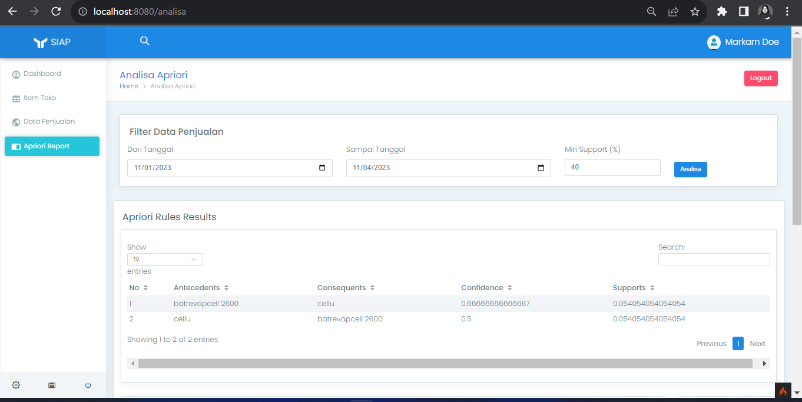
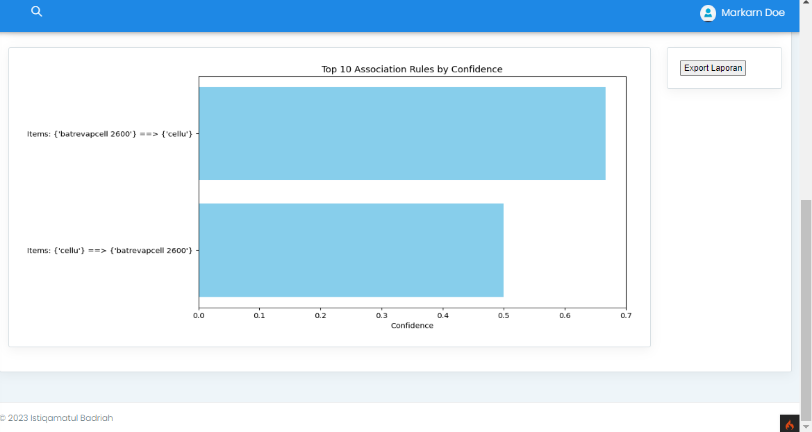

# Market Basket Analysis Web App using MLxtend, CodeIgniter 4, Flask, and MySQL Workbench

# Description
A simple website based for market basket analysis using apriori algorithm. It allows users to input item data, daily sales, and perform Apriori analysis using MLxtend. The application is developed using CodeIgniter 4 for the front-end, Flask for API-based modeling, and MySQL Workbench for the database.

# Table of Content
  - [Installation](#installation)
  - [Run the project](#run-the-project)

# Installation
To run this project locally, follow these steps:
## Prerequisites
* [CodeIgniter 4](https://codeigniter4.github.io/CodeIgniter4/) 
* Python 3.11
* [Miniconda](https://docs.conda.io/en/latest/miniconda.html) (optional)
* [MySQL Workbench](https://dev.mysql.com/downloads/workbench/)
  
## Step
1. Clone the repository: 
`git clone https://github.com/nissajelita/apriori-mba.git`
2. Create the necessary database by import [dbapriori.sql](/siweb/database/dbapriori.sql) on MySQL Workbench.
4. Set up the CodeIgniter 4 environment and configure the database settings by [change this configuration](/siweb/env).
5. Set up python library for running the Flask API model. If you had miniconda, you can simply go to miniconda prompt go to folder which had [env_mba.yml](/env_mba.yml) and running the command `conda env create -f env_mba.yml`

# Run the project
* git bash on folder [siweb](/siweb) and run this command `git spark serve`. If the installation fails, make sure that Composer is installed on your local machine by running command `composer` in the terminal. If you haven't, please download and install it by following the instructions on the official [composer](https://getcomposer.org/download/)] website.
* open [app.py](/app.py) and activate the environtment by runing `conda activate env_mba`, then run `python app.py` to run the backend.
* The web app will start on localhost:8080

This following screenshot showed the result of analysis based on the data
{:height="200px"}
{:height="200px"}
